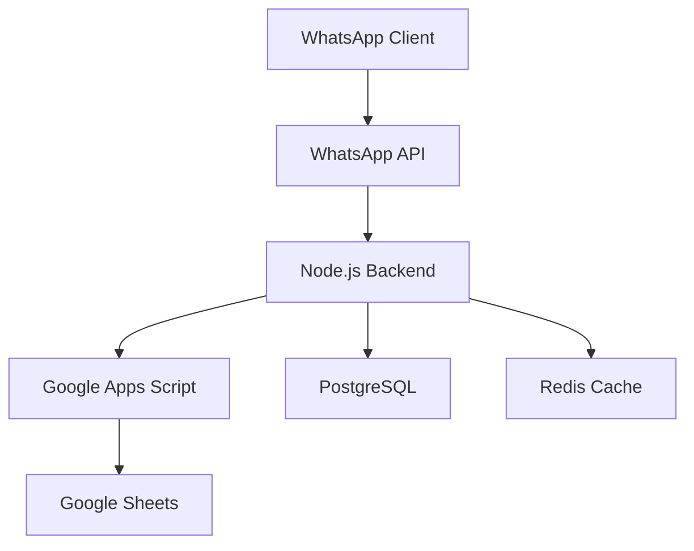

# 🏗️ Architecture Overview

## 📋 Overview

Dokumentasi ini menjelaskan arsitektur sistem Chatbot Identifikasi Stunting, termasuk komponen utama, alur data, dan interaksi antar komponen.

## 🏗️ System Architecture

## 🔄 Data Flow

1. **User Interaction**
   - User mengirim pesan via WhatsApp
   - WhatsApp API meneruskan ke backend
   - Backend memproses pesan
   - Response dikirim kembali ke user

2. **Data Processing**
   - Data disimpan di Google Sheets
   - Cache disimpan di Redis
   - Metadata disimpan di PostgreSQL
   - Backup otomatis ke cloud storage

## 🏗️ Component Architecture

### 1. Frontend Layer
- WhatsApp Business API
- Web Interface (Admin Panel)
- Mobile Interface (PWA)

### 2. Backend Layer
- Node.js Server
- Express.js Framework
- WebSocket Server
- API Gateway

### 3. Data Layer
- Google Sheets (Primary Storage)
- PostgreSQL (Metadata)
- Redis (Caching)
- Cloud Storage (Backup)

## 🔧 Technical Stack

### Backend
- Node.js
- Express.js
- Socket.io
- Redis
- PostgreSQL

### Frontend
- React.js
- Material-UI
- PWA
- WebSocket Client

### DevOps
- Docker
- GitHub Actions
- Google Cloud Platform
- Cloud Run

## 🔒 Security Architecture

### 1. Authentication
- API Key Authentication
- JWT for Web Interface
- OAuth2 for Google Services

### 2. Authorization
- Role-based Access Control
- Resource-based Permissions
- API Rate Limiting

### 3. Data Security
- End-to-end Encryption
- Data Encryption at Rest
- Secure Communication (HTTPS)

## 📊 Monitoring Architecture

### 1. Application Monitoring
- Google Cloud Monitoring
- Custom Metrics
- Error Tracking
- Performance Monitoring

### 2. Log Management
- Google Cloud Logging
- Error Logs
- Access Logs
- Audit Logs

## 🔄 Deployment Architecture

### 1. Development
- Local Development
- Docker Containers
- Hot Reloading
- Debug Tools

### 2. Staging
- Cloud Run
- Test Database
- Monitoring
- Load Testing

### 3. Production
- Cloud Run
- Production Database
- CDN
- Load Balancer

## 📚 Dokumentasi Terkait

- [System Overview](system-overview.md)
- [Technical Stack](technical-stack.md)
- [Project Structure](project-structure.md)

---

### 🔗 Navigasi

[⬅️ Kembali ke Getting Started](../getting-started/README.md) | [Lanjut ke Features ➡️](../features/README.md)

 