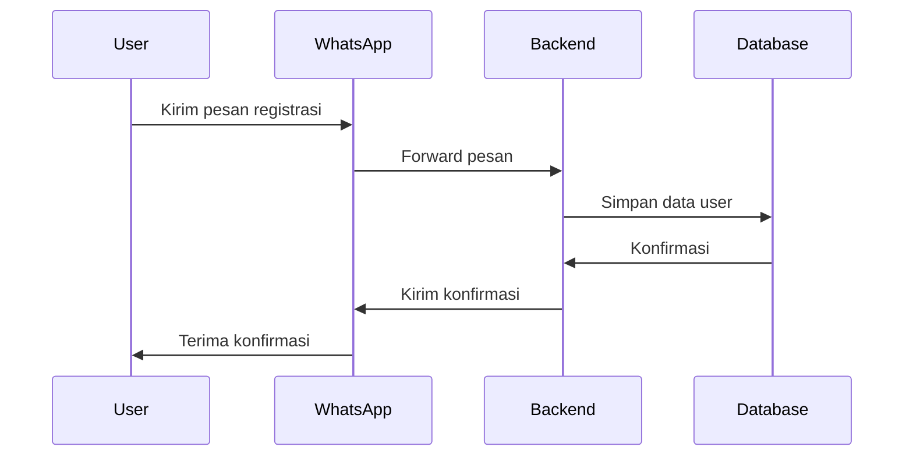
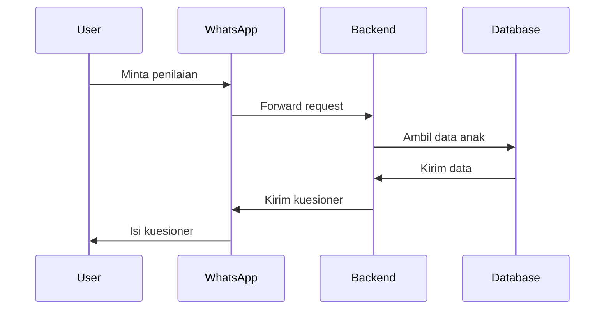

# ✨ Features Overview

## 📋 Overview

Dokumentasi ini menjelaskan fitur-fitur utama dari Chatbot Identifikasi Stunting, termasuk cara kerja dan interaksi antar fitur.

## 🎯 Core Features

### 1. User Management
- Registrasi pengguna
- Manajemen profil
- Autentikasi
- Manajemen sesi

### 2. Child Data Management
- Pencatatan data anak
- Riwayat pertumbuhan
- Pengukuran antropometri
- Analisis perkembangan

### 3. Questionnaire System
- Kuesioner stunting
- Skoring otomatis
- Rekomendasi
- Riwayat penilaian

### 4. WhatsApp Integration
- Chat interaktif
- Notifikasi
- Pengiriman media
- Template pesan

## 🔄 Feature Workflows

### 1. User Registration Flow

### 2. Child Assessment Flow

## 📊 Feature Details

### User Registration

🔍 Detail Registrasi User

#### Proses Registrasi
1. User mengirim pesan "DAFTAR"
2. Bot meminta data:
   - Nama lengkap
   - Nomor telepon
   - Alamat
   - Tanggal lahir
3. Data divalidasi
4. Akun dibuat
5. Konfirmasi dikirim

### Child Management

🔍 Detail Manajemen Anak

#### Fitur Utama
1. Tambah data anak
2. Update data
3. Lihat riwayat
4. Analisis pertumbuhan
5. Rekomendasi

### Questionnaire System

🔍 Detail Sistem Kuesioner

#### Jenis Kuesioner
1. Kuesioner Awal
2. Kuesioner Lanjutan
3. Kuesioner Monitoring
4. Kuesioner Evaluasi

### WhatsApp Integration

🔍 Detail Integrasi WhatsApp

#### Fitur Chat
1. Pesan teks
2. Pesan media
3. Template pesan
4. Quick replies
5. Buttons

## 🎨 User Interface

### 1. WhatsApp Interface
- Menu interaktif
- Tombol cepat
- Template pesan
- Media sharing

### 2. Admin Interface
- Dashboard
- Manajemen user
- Laporan
- Konfigurasi

## 📱 Mobile Experience

### 1. PWA Features
- Offline support
- Push notifications
- Home screen install
- Responsive design

### 2. Mobile Optimization
- Fast loading
- Touch friendly
- Battery efficient
- Data saving

## 📚 Dokumentasi Terkait

- [User Registration](user-registration.md)
- [Child Data Management](child-data-management.md)
- [Questionnaire System](questionnaire-system.md)
- [WhatsApp Integration](whatsapp-integration.md)

---

### 🔗 Navigasi

[⬅️ Kembali ke Architecture](../architecture/README.md) | [Lanjut ke API Documentation ➡️](../api/README.md)

 