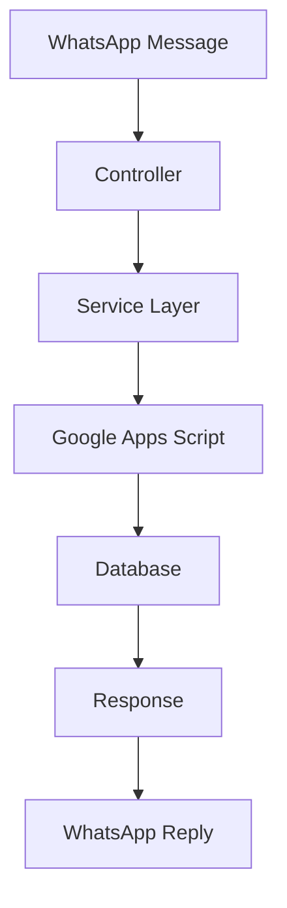

# 🛠️ Technical Implementation

<div align="center">


</div>

## 📋 Overview

Bagian ini menjelaskan implementasi teknis dari Chatbot Identifikasi Stunting, termasuk struktur kode, komponen utama, dan alur kerja sistem.

## 🏗️ Komponen Utama

### Controllers
- Menangani logika bisnis utama
- Memproses request dari WhatsApp
- Mengelola interaksi dengan services
- Validasi input dan output

### Services
- Implementasi logika bisnis
- Integrasi dengan Google Apps Script
- Pemrosesan data dan kalkulasi
- Manajemen state dan session

### Models
- Definisi struktur data
- Validasi data
- Relasi antar entitas
- Transformasi data

### Utils & Helpers
- Fungsi utilitas umum
- Helper untuk format data
- Konstanta dan konfigurasi
- Error handling

## 🔄 Alur Kerja



## 📦 Struktur Kode

```
src/
├── controllers/
│   ├── userController.js
│   ├── childController.js
│   └── questionnaireController.js
├── services/
│   ├── userService.js
│   ├── childService.js
│   └── questionnaireService.js
├── models/
│   ├── userModel.js
│   ├── childModel.js
│   └── questionnaireModel.js
└── utils/
    ├── constants.js
    ├── helpers.js
    └── validators.js
```

## 🔍 Detail Implementasi

### Controllers
<details>
<summary>📝 User Controller</summary>

```javascript
class UserController {
  async register(req, res) {
    // Implementasi registrasi user
  }

  async getProfile(req, res) {
    // Implementasi get profile
  }
}
```
</details>

### Services
<details>
<summary>📝 User Service</summary>

```javascript
class UserService {
  async createUser(userData) {
    // Implementasi create user
  }

  async getUserByPhone(phone) {
    // Implementasi get user
  }
}
```
</details>

### Models
<details>
<summary>📝 User Model</summary>

```javascript
class User {
  constructor(data) {
    this.id = data.id;
    this.name = data.name;
    this.phone = data.phone;
  }
}
```
</details>

## 🎯 Best Practices

1. **Code Organization**
   - Gunakan struktur modular
   - Pisahkan concerns
   - Gunakan design patterns yang sesuai

2. **Error Handling**
   - Implementasi try-catch
   - Logging yang proper
   - Error response yang konsisten

3. **Performance**
   - Optimasi query
   - Caching jika diperlukan
   - Async/await untuk operasi I/O

4. **Security**
   - Validasi input
   - Sanitasi data
   - Rate limiting

## 📚 Dokumentasi Terkait

- [Controllers](controllers.md)
- [Services](services.md)
- [Models](models.md)
- [Utils & Helpers](utils.md)

---

<div align="center">

### 🔗 Navigasi

[⬅️ Kembali ke Dokumentasi Utama](../README.md) | [Lanjut ke Development ➡️](../development/README.md)

</div> 